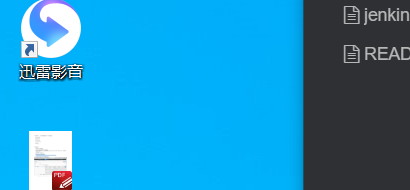

```bash
yum install -y wget
wget https://mirrors.aliyun.com/docker-ce/linux/centos/docker-ce.repo -O/etc/yum.repos.d/docker-ce.repo
yum clean all
yum makecache
yum install  -y docker-ce-20.10.1-3.el7
systemctl start docker
systemctl enable docker
wget https://github.com/docker/compose/releases/download/1.25.4/docker-compose-Linux-x86_64 /root/docker-compose
/bin/cp /root/docker-compose /usr/local/bin
chmod 777 /usr/local/bin/docker-compose

cat >> /etc/docker/daemon.json << EOF
{
  "registry-mirrors": [
    "https://hub-mirror.c.163.com",
    "https://mirror.baidubce.com"
  ]
}
EOF

systemctl restart docker


```




